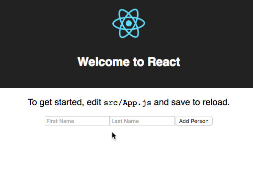

# `create-react-app` ... with Redux

This is a barebones implementation of Redux with a React app that was generated with `create-react-app`, and then ejected with `npm run eject`.

:bulb: This repository consists of two commits and only two commits.  

 1. **first commit** is the base code of a `create-react-app` app source code after eject (`npm run eject`)
 2. **second commit** are the sample additions to implement basic redux

:bulb: :bulb: It is worth noting that it is **not** required to run `npm run eject` in order to get Redux implemented in this app.  Implementing Redux in the app without ejecting is completely possible.

# Token
A token is a database that maps account balances to account addresses and lets functions manipulate those data points.

All the users balances are stored in the Balances.sol contract. Balances.sol has an api that lets other contracts manipulate its data if they have permission.

All the standard token functionality (ie transfer tokens) is stored in the HumanStandardToken.sol contract.

For most consumers, they will only have to have interface with HumanStandardToken.

## Basic Token
Balances + HumanStandardToken

## Basic Token with ICO
Balances + HumanStandardToken + ICO

# Launch Token 

## Launch Balances.sol
 - Launch Balances.sol and get address generated from launching contract.

## Add Issuance Module to launched Balances contract
 - Launch issuance module and set Balances == Balances.address from the previously launched Balances.sol contract
 - setModule module.address = true @ balances contract.

## Example
 - Launch Balances.sol and get address generated from launching contract.
 - Launch HumanStandardToken with Token meta data and Balances.address.
 - setModule HumanStandardToken.address == true at Balances contract
